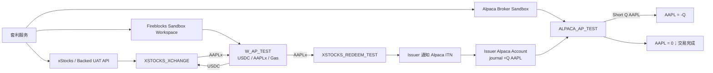

# xStocks Redeem 实时测试（UAT）计划

## 1. 目标、范围与命名

本计划将当前 Token 折价 / redeem 回测落成 xStocks / Backed 与 Alpaca 的真实测试环境（UAT / Sandbox）流程：

```text
低价买入 AAPLx
→ 在 Alpaca 卖空等量 AAPL
→ AAPLx 到 W_AP_TEST
→ AAPLx 转入 Issuer Redemption Wallet
→ Issuer 通知 Alpaca ITN
→ AAPL journal 到同一个 Alpaca AP 账户
→ AAPL 净仓位归零
```

本文采用以下逻辑名称。真正的账号 ID、网络、合约和地址仅由三方 UAT integration spec 填入，严禁将密钥或真实地址写入仓库。

| 逻辑名称 | 含义 |
|---|---|
| `BACKED_CLIENT_TEST` | 我方 xStocks / Backed UAT Client / AP 身份 |
| `ALPACA_AP_TEST` | 我方 Alpaca Broker Sandbox AP 账户 |
| `FIREBLOCKS_TEST_WORKSPACE` | 我方 Fireblocks Sandbox Workspace |
| `FB_VAULT_ARB_01` | UAT 专用 Fireblocks Vault Account |
| `W_AP_TEST` | `FB_VAULT_ARB_01` 在目标链的主要钱包地址 |
| `XSTOCKS_XCHANGE` | 发行方的 xChange Atomic RFQ Settlement 合约/服务 |
| `XSTOCKS_REDEEM_TEST` | 发行方提供的 xPort / ITN UAT Redemption Wallet |
| `ISSUER_ALPACA_ACCOUNT` | 发行方在 Alpaca 用于向 AP journal AAPL 的账户 |

### 1.1 两类 redeem 不可混用

本策略的 `ITN redeem` 是 `AAPLx → AAPL`。触发方式是从 `W_AP_TEST` 向发行方指定的 `XSTOCKS_REDEEM_TEST` 转出 AAPLx，然后由发行方通知 Alpaca。它不是我方调用 Alpaca 的 `/redeem` API，也不应与“Token 卖出换稳定币”的链上 redeem/sell 混为一谈。

## 2. 最小化 UAT 拓扑

第一版只使用一个策略主体、一个 Alpaca AP Sandbox 账户、一个 Fireblocks Workspace、一个主 Vault 和一个主链上钱包。



## 3. 账户、钱包、地址与职责

| 对象 | 控制方 | 类型 | 主要职责 |
|---|---|---|---|
| `BACKED_CLIENT_TEST` | 我们 | xStocks / Backed 测试 Client / AP | 申请 RFQ、注册钱包、使用 xChange 和 xPort / ITN 身份 |
| `ALPACA_AP_TEST` | 我们 | Alpaca Broker Sandbox Account | 卖空 AAPL，最终接收 redeem 后的 AAPL |
| `FIREBLOCKS_TEST_WORKSPACE` | 我们 | Fireblocks Sandbox Workspace | API 调用、审批、签名和广播 |
| `FB_VAULT_ARB_01` | 我们 | Fireblocks Vault Account | 持有稳定币、AAPLx 和原生 Gas |
| `W_AP_TEST` | 我们 | Vault 在目标链上的地址 | 支付 Token Buy、接收 AAPLx、发起 redeem |
| `XSTOCKS_XCHANGE` | 发行方 | Atomic RFQ Settlement | 以稳定币和 AAPLx 原子结算正式 RFQ |
| `XSTOCKS_REDEEM_TEST` | 发行方 | xPort / ITN Redemption Wallet | 接收并触发 AAPLx 的 in-kind redeem |
| `ISSUER_ALPACA_ACCOUNT` | 发行方 | Alpaca securities account | 在 ITN 回调后将 AAPL journal 给 `ALPACA_AP_TEST` |

### 3.1 同一个 Alpaca 账户必须完成短仓与收券

第一版不可拆分交易账户和 tokenization 账户：

```text
卖空 AAPL 的账户 = redeem 后收到 AAPL 的账户 = ALPACA_AP_TEST
```

预期库存变化为：

```text
开始：AAPL = 0
卖空 Q 股后：AAPL = -Q
redeem journal 后：AAPL = -Q + Q = 0
```

若把短仓和收券分到两个账户，公司总体虽可能中性，但每个账户都未闭环，必须另做 journal 或 position transfer；这不属于第一版 UAT 范围。

### 3.2 `W_AP_TEST` 同时承担三种钱包职责

第一版统一设置：

```text
paymentWalletIdentifier   = W_AP_TEST
receivingWalletIdentifier = W_AP_TEST
redeem origin wallet      = W_AP_TEST
```

资产流：

```text
USDC / 支持稳定币：W_AP_TEST → XSTOCKS_XCHANGE
AAPLx：               XSTOCKS_XCHANGE → W_AP_TEST
AAPLx redeem：        W_AP_TEST → XSTOCKS_REDEEM_TEST
```

这样避免内部钱包划转、额外白名单、余额同步、Gas 与对账复杂度。多钱包架构须在单钱包 UAT 通过后另行设计。

### 3.3 地址配置与白名单

所有地址以如下唯一键登记，不能只存裸地址字符串：

```text
environment + issuer + network/chain_id + asset + owner
```

每项至少记录：

```text
network
token_symbol
token_contract
address
address_role
effective_from
last_verified_at
```

其中 `W_AP_TEST` 必须同时：

1. 注册/白名单至 `BACKED_CLIENT_TEST`；
2. 属于 `FB_VAULT_ARB_01`，并由 `FIREBLOCKS_TEST_WORKSPACE` 控制；
3. 映射至 `ALPACA_AP_TEST`；
4. 在 Fireblocks 中将 `XSTOCKS_REDEEM_TEST` 配置为 External Wallet 并完成白名单；
5. 如 xChange 需要合约调用，为 xChange 合约配置 Contract Wallet / Contract Call Policy。

`XSTOCKS_REDEEM_TEST` 不可永久硬编码。服务启动或定期从发行方支持的 in-kind sweeping-wallet 资料/API 读取，并在每次 redeem 前校验目标网络、Token 和地址仍匹配。

## 4. UAT 前置条件

### xStocks / Backed

- `BACKED_CLIENT_TEST` 已启用 xChange 和 xPort / ITN entitlement。
- `W_AP_TEST` 已是该 Client 的 Registered / Whitelisted Wallet。
- 已确认 `BACKED_CLIENT_TEST ↔ ALPACA_AP_TEST` 的 AP mapping。
- 已提供测试网络、AAPLx 测试 deployment、稳定币、数量精度与支持资产。
- 已提供 AAPLx 最小/最大订单金额、RFQ execution timeout、交易暂停状态与 redemption wallet 查询机制。

### Alpaca

- 使用 **Alpaca Broker Sandbox**，而不是独立个人 Paper Account。
- `ALPACA_AP_TEST` 可通过指定 `account_id` 下单、做空 AAPL、查询 Tokenization Requests。
- 已验证该账户具备 short/borrow 权限与足够保证金。
- Issuer 已确认 `ISSUER_ALPACA_ACCOUNT` 有可 journal 的测试 AAPL，且 redeem 股票会进入同一个 `ALPACA_AP_TEST`。

### Fireblocks

- `FIREBLOCKS_TEST_WORKSPACE`、API User、认证方式、签名模式与自动化金额上限已创建。
- `FB_VAULT_ARB_01` 持有目标链原生 Gas、测试稳定币和测试 AAPLx。
- 已完成 `XSTOCKS_REDEEM_TEST`、xChange 合约/目标地址（如适用）的白名单和交易策略。

## 5. 实时执行流程

### Step 0：接收行情与指示性报价

持续接收：

```text
AAPL bid / ask / bid size / ask size
AAPLx RFQ / indicative quote
```

只有满足下式才创建机会：

```text
expected_net_edge
= stock_short_proceeds
- token_buy_cost
- stock fees
- RFQ fees
- gas
- borrow cost
- stablecoin cost
> minimum_required_profit
```

### Step 1：读取当前 Asset Configuration

真实环境不再固定 `Token Qty = 10` 或 `RFQ TTL = 30s`。在请求正式报价前，读取发行方当前 AAPLx 资产配置（例如 UAT 文档中的 xChange asset endpoint），至少获得：

```text
minOrderFiatValue
maxOrderFiatValue
executionTimeoutSeconds
isTradingHalted
network
token deployment
```

校验数量、网络、资产部署、订单上下限、交易暂停状态和报价有效期。

### Step 2：申请正式 Hard RFQ

以 `AAPLx`、`Buy`、数量和目标测试网络请求 Hard RFQ，并明确传入：

```text
paymentWalletIdentifier   = W_AP_TEST
receivingWalletIdentifier = W_AP_TEST
```

创建全局 `trade_id`，保存：

```text
xstocks_quote_id
xstocks_price
xstocks_qty
network
expiration
execution_timeout
signature
signature_payload
contract
token_deployment
```

### Step 3：在同一个 AP 账户卖空 AAPL

向 `ALPACA_AP_TEST` 提交严格限价 FOK/IOC 的 `SELL / SHORT AAPL`，数量为 `Q`。保存：

```text
alpaca_account_id
alpaca_short_order_id
alpaca_client_order_id
symbol / side / qty
submitted_at / filled_at
filled_qty / filled_avg_price / status
```

只有 `filled_qty == Q`，才能执行 Token Buy；部分成交、拒绝或取消时不得执行完整 Token Buy。

### Step 4：执行 xChange Token Buy

短仓全额成交后，执行已锁定的 Hard RFQ：

```text
W_AP_TEST -- 稳定币 --> XSTOCKS_XCHANGE
XSTOCKS_XCHANGE -- AAPLx --> W_AP_TEST
```

期望状态：

```text
ALPACA_AP_TEST：AAPL = -Q
W_AP_TEST：AAPLx = +q
```

成功不能只以 Fireblocks 创建交易判断，必须同时确认链上 receipt 成功及 `W_AP_TEST` 的 AAPLx 可用余额增加。

### Step 5：发起真正的 ITN redeem

AP 的 redeem trigger 是普通的链上 Token 转账：

```text
FROM:  W_AP_TEST
ASSET: AAPLx
QTY:   q
TO:    XSTOCKS_REDEEM_TEST
```

链上确认后只能标记为 `redeem_tx_confirmed`：这证明 Token 已经送达发行方，**不证明** AAPL 已到账。

### Step 6：Issuer 识别并通知 Alpaca

发行方根据以下身份链决定股票接收账户：

```text
W_AP_TEST
→ BACKED_CLIENT_TEST
→ Authorized Participant identity
→ ALPACA_AP_TEST / account_id
```

Issuer 检测到正确的 `from`、Token、数量、网络和 `tx_hash` 后，向 Alpaca ITN 发送 redeem callback。该 callback 只能由 Issuer 发起；我方系统只负责发 Token、保存证据、读取状态和对账。

### Step 7：Alpaca journal 与最终完成

```text
ISSUER_ALPACA_ACCOUNT -- journal +Q AAPL --> ALPACA_AP_TEST
```

系统轮询/订阅 Alpaca Tokenization Request，等待：

```text
type   = redeem
status = pending → completed | rejected
```

仅在以下两条均成立时才将交易标记为 `trade_completed`、PnL 标记为已实现、保证金视为可释放：

```text
redeem_request.status == completed
ALPACA_AP_TEST.position(AAPL) == expected_position
```

最常见预期为：

```text
position_before_short = 0
position_after_short  = -Q
position_after_redeem = 0
```

## 6. 真实状态机

回测中的单一 `redeem_pending` 必须拆分，便于准确定位故障：

```text
opportunity_detected
  → rfq_requested
  → rfq_received
  → rfq_reserved
  → short_order_created
  → short_order_submitted
  → short_order_filled
  → token_buy_created
  → token_buy_signed
  → token_buy_broadcast
  → token_buy_confirmed
  → token_received
  → redeem_transfer_created
  → redeem_transfer_signed
  → redeem_tx_broadcast
  → redeem_tx_confirmed
  → issuer_redeem_detected
  → alpaca_redeem_pending
  → alpaca_redeem_completed
  → underlying_position_observed
  → short_closed_by_journal
  → trade_completed
```

主要异常状态：

```text
short_rejected / short_partial_fill / short_cancelled
rfq_expired / rfq_rejected / rfq_unknown
token_buy_sign_failed / token_buy_broadcast_failed
token_buy_chain_failed / token_buy_unknown
redeem_tx_failed
alpaca_redeem_rejected
reconciliation_incident
```

| 可见状态 | 优先排查方向 |
|---|---|
| redeem 交易未上链 | Fireblocks policy、签名、Gas、RPC、白名单 |
| redeem tx 已确认，Issuer 未识别 | 错误地址/Token/网络、钱包 mapping、Issuer indexer |
| Issuer 已识别，Alpaca 仍 pending | Issuer callback、ITN、账户映射、journal |
| Alpaca completed，仓位仍不正确 | 账务与对账事故，人工接管 |

## 7. 测试分阶段与验收标准

不要第一天直接运行完整自动套利；按下列顺序推进。

| 测试 | 目标 | 验收 |
|---|---|---|
| UAT-01 Wallet Connectivity | Fireblocks → External Wallet | 白名单、policy、签名、广播、确认均成功 |
| UAT-02 Token Receive | xChange / 测试注资 → `W_AP_TEST` | AAPLx 余额、合约、精度和网络均匹配 |
| UAT-03 Redeem Only | `W_AP_TEST → XSTOCKS_REDEEM_TEST → Alpaca` | AAPLx 扣减、redeem request completed、`ALPACA_AP_TEST +Q AAPL` |
| UAT-04 Short + Redeem | 短仓后以等量 AAPLx redeem | `ALPACA_AP_TEST` 最终 AAPL = 0 |
| UAT-05 xChange Buy + Redeem | 稳定币 → AAPLx → AAPL | 全链路资产与关联 ID 可对账；不自动 short |
| UAT-06 Full Arbitrage | 报价 → short → buy → redeem → journal | 状态机闭环、AAPL = 0、PnL/保证金/对账正确 |

### 7.1 发行方 UAT 未能直连 Alpaca 时的降级测试

允许分成两层，但不得声称端到端 ITN 已通过：

1. **Layer 1：真实链上**：验证 `W_AP_TEST → XSTOCKS_REDEEM_TEST` 的 Token、网络、`tx_hash` 与确认。
2. **Layer 2：证券侧仿真**：在 Alpaca Broker Sandbox 用发行方 Sandbox 账户向 `ALPACA_AP_TEST` journal `+Q AAPL`，验证短仓关闭、保证金、PnL、对账和状态机。

Layer 2 仅是 `Alpaca-side settlement simulation`；只有 UAT-03 真实回调和 journal 成功，才可称 Issuer xPort / ITN 端到端打通。

## 8. 每笔交易的可观测性与对账

每次执行机会时立即生成统一 `trade_id`，下列标识全部挂在同一笔交易下：

```text
trade_id
├── xstocks_soft_quote_id
├── xstocks_quote_id
├── alpaca_account_id
├── alpaca_short_order_id
├── alpaca_client_order_id
├── fireblocks_buy_tx_id
├── buy_tx_hash
├── payment_wallet
├── receiving_wallet
├── redemption_address
├── fireblocks_redeem_tx_id
├── redeem_tx_hash
├── issuer_request_id
├── alpaca_tokenization_request_id
└── final_position_check
```

### 8.1 真实时间点与风险窗口

固定 500ms、1s、3.1s 等回测延迟不能用于验收。必须记录：

```text
t0  opportunity_detected
t1  rfq_received
t2  short_order_submitted
t3  short_filled
t4  token_buy_tx_created
t5  token_buy_tx_broadcast
t6  token_buy_tx_confirmed
t7  token_balance_observed
t8  redeem_tx_created
t9  redeem_tx_broadcast
t10 redeem_tx_confirmed
t11 alpaca_redeem_pending_observed
t12 alpaca_redeem_completed
t13 underlying_position_observed
```

重点量化：

```text
裸空窗口：short_filled → token_buy_confirmed = t3 → t6
redeem 结算窗口：redeem_tx_broadcast → position observed = t9 → t13
```

对每段延迟统计 `p50 / p95 / p99 / max`，覆盖 RFQ、下单、Token 链上确认、余额可见、redeem 确认、Alpaca pending/completed 和持仓可见。

### 8.2 最终对账不变量

成功交易必须同时满足：

```text
W_AP_TEST 的稳定币减少 = Token Buy 实际成本 + 链上相关费用
W_AP_TEST 的 AAPLx：buy 后 +q，redeem 后为 0（扣除可确认的精度残余）
ALPACA_AP_TEST 的 AAPL：-Q → 0
Alpaca Tokenization Request：type=redeem, status=completed
request 的 wallet_address、tx_hash、数量、网络与本 trade_id 完全一致
```

## 9. 三方 UAT 资料清单

### 向 xStocks / Backed 确认

```text
Test / UAT Client ID 与认证方式
xChange entitlement
xPort / ITN entitlement
Supported Test Network
Test Token Deployment
W_AP_TEST registered-wallet 状态
AAPLx min/max order 与 RFQ execution timeout
In-kind redemption / sweeping wallet 的查询与变更机制
BACKED_CLIENT_TEST → ALPACA_AP_TEST mapping
Redeem request 状态、webhook 和 Issuer callback 行为
```

最关键的书面确认是：

```text
BACKED_CLIENT_TEST 能否映射到指定的 Alpaca Broker Sandbox AP account，
并在 AAPLx redeem 后将 AAPL journal 到该同一账户？
```

### 向 Alpaca 确认

```text
Broker Sandbox credentials 与 AP_ACCOUNT_ID_TEST
Trading API access
AAPL short capability / borrow / margin
ITN 与 Tokenization Request API enabled
Backed Client / AP → Alpaca account mapping
redeem 的 underlying 是否 journal 到 ALPACA_AP_TEST
```

### 向 Fireblocks 准备

```text
Sandbox Workspace、API User、认证、co-signer / signing mode
FB_VAULT_ARB_01 与 W_AP_TEST
目标链原生 Gas、稳定币、AAPLx
金额上限与自动审批交易策略
Issuer Redemption Wallet whitelist
xChange contract whitelist（如适用）
```

## 10. 参考与优先级

- 具体 UAT 账户、接口、网络、合约、地址和 entitlement：以 xStocks / Backed、Alpaca、Fireblocks 提供的私有 integration spec 为准。
- 本仓库的具体业务分析：[xstocks_redeem_real_time_uat_account_flow.md](xstocks_redeem_real_time_uat_account_flow.md)。
- Alpaca ITN AP 一般流程：<https://docs.alpaca.markets/us/docs/tokenization-guide-for-authorized-participant>
- Alpaca Tokenization Request 查询：<https://docs.alpaca.markets/us/reference/gettokenizationrequests>

公开文档用于解释 Alpaca 的责任边界；xStocks/Backed UAT 文档优先决定实际的 RFQ、钱包注册、扫款地址、回调和网络行为。
