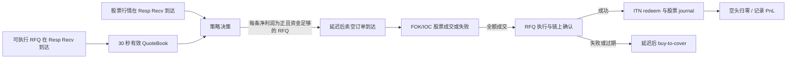

# ALPACA ITN Token 折价（Redeem）套利回测设计

## 0. 文档目的与当前结论

本回测只覆盖 **Token 折价 / redeem 方向**：Token 便宜、股票较贵时，锁定 Token Buy RFQ，卖空等效股票，买入 Token 并通过 ITN redeem 为股票，最终以到账股票抵消空头。

当前三天数据足以搭建一个可信的、带延迟和 RFQ 到期约束的 **历史影子回测（shadow backtest）**，用于回答“出现过多少可执行信号、不同延迟下还能剩多少 edge、风险敞口有多久”。已确认每条 `xStocks Price (USD)` 是可执行的全额 Token Buy RFQ 价格；但 CSV 仍没有 quote ID、实际股票成交回报或 ITN 链路结果。因此首个版本应称为 **基于历史可执行 RFQ 价格的模拟成交回放**，不能称为实际成交 PnL。

本设计是后续实现的长期工作约定；关键假设、未决问题和默认参数必须显式保存在配置中，不能散落在代码里。

来源：

- [套利知识与账户/磨损说明](kown.md)
- [Ondo × Alpaca ITN 流程](ondo_alpaca_itn_arbitrage_process.md)
- [RFQ 锁价提示](notice.md)
- 原始观测：`data/xstocks_log_2026-07-28.csv`、`data/xstocks_log_2026-07-29.csv`、`data/xstocks_log_2026-07-30.csv`

---

## 1. 策略定义：已经确定的部分

### 1.1 经济方向和交易顺序

设：

```text
q = 买入的 Token 数量
m = 每枚 Token 对应的股票数量（multiplier）
Q = q × m = 要做空的等效股票数量
P_token = RFQ 中 q 枚 Token 的总成本（以 USD 等值计）
P_stock = 股票实际卖空成交价
```

方向为：

```text
获得 Buy RFQ（锁定 30 秒）
  → 卖空 Q 股股票，按当时可成交 bid 立即成交
  → 执行该 Buy RFQ，获得 q 枚 Token
  → redeem Token 为 Q 股股票
  → 到账股票抵消空头
```

在 Token 买入成功后，组合为“多 Token、空等效股票”，等待 redeem 的价格 Delta 大致对冲；真正的未对冲风险主要发生在“股票已卖空但 RFQ 尚未成功”这段时间。

### 1.2 信号和阈值

对一条仍可执行的 RFQ `j`，使用股票实际可成交 bid 计算：

\[
gross\_edge\_bps_j = \frac{P_{stock,j}Q_j-P_{token,j}}{P_{stock,j}Q_j}\times 10,000
\]

第一版在触发时不拆分预扣各项费用，而是在交易结束时一次性扣除总成本。因此：

\[
total\_cost_j = P_{stock,j}Q_j\times\frac{total\_cost\_deduction\_bps}{10,000}
\]

```text
按 Token 价格从低到高检查所有可执行且未占用 RFQ
触发条件 = gross_edge_bps > total_cost_deduction_bps + minimum_net_profit_bps
资金条件 = cash_balance - 已冻结 Token 成本 - 已冻结空头保证金 >= 当前 RFQ 的 Token 成本 + 预计空头保证金
最终净利润 = 股票卖空收入 - Token 买入成本 - total_cost
```

`total_cost_deduction_bps` 是用户可修改的单一总成本参数，按实际股票卖空名义金额计算，并只在交易最终闭合时扣除一次。`minimum_net_profit_bps` 默认 0，所以当前规则就是“扣完 15bps 总成本后仍严格为正才交易”。报告仍必须同时给出毛 edge、毛 PnL、总成本和净 PnL。

### 1.3 RFQ 不等于普通盘口

每条 RFQ 是一份独立、一次性、会过期的交易权利，而不是可无限成交的一档价格。对象至少应有：

```text
quote_id, symbol, side, token_qty, multiplier, total_cost,
received_at, expires_at, remaining_qty, status, source_row_id
```

状态流转为：

```text
active → reserved → stock_filled → rfq_executing → token_received
       → redeem_pending → completed
                 ↘ rfq_failed → emergency_cover → failed_closed
active/reserved → expired
```

一条 quote 被 `reserved` 后，不得再被另一笔机会使用；回测必须维护该约束。不可将 30 秒内的价格视为可以重复赚取的 30（或更多）笔交易。

---

## 2. 时间规则和事件驱动模型

### 2.1 统一时钟

所有内部时间使用时区感知的 UTC `datetime`；报告另附美东时间。原始日志覆盖 2026-07-28 至 2026-07-30 每日约 **13:25–20:05 UTC**（夏令时即美东约 09:25–16:05）。不可将 CSV 时间作为本地时间再次转换。

对于一条原始数据，时间语义默认是：

```text
Req Sent (UTC)  = 请求发出；不能在此刻使用返回价格
Resp Recv (UTC) = 数据在策略服务器可见；quote 的可用起点
expires_at      = Resp Recv (UTC) + rfq_ttl_seconds（默认 30 秒）
```

这个“从响应开始锁 30 秒”的规则来自当前业务假设。若真实 API 的到期时间从请求、服务端签发或 attestation 生成开始计算，必须切换到真实字段并重跑全部结果。

### 2.2 事件而非逐秒循环

引擎按时间排序执行事件；同一时间戳采用固定优先级（先行情/RFQ 到达，再策略决策，再订单/状态事件），以保证结果可重复。



任何价格都只可在回测时钟已经到达其 `Resp Recv (UTC)` 后使用。禁止用未来行来填充当前 bid/ask 或 RFQ，避免 look-ahead bias。

### 2.3 一笔折价交易的模拟时间线

对信号时刻 `t0`：

```text
t0                          从 QuoteBook 按价格扫描；每条合格 quote 独立 reserve
t0 + strategy_compute_ms    发出股票卖空请求
+ alpaca_submit_ms
+ exchange_route_ms          订单到市场；使用该时刻 as-of 的股票 bid/size
+ stock_fill_report_ms       得到成交结果

若全额成交：
t_stock_fill
+ rfq_submit_ms
+ fireblocks_policy_ms
+ fireblocks_sign_ms
+ tx_broadcast_ms
+ chain_confirm_ms            RFQ 买入 Token 成功（或失败）

若 Token 成功：
t_token_received
+ redeem_submit_ms
+ redeem_chain_confirm_ms
+ issuer_process_ms
+ alpaca_journal_ms           股票到账并抵消空头
```

`RFQ` 的到期检查必须在真实协议要求的时刻进行，配置项为：

```text
rfq_expiry_gate = broadcast | confirmation
```

不知道真实协议前，默认采用保守的 `confirmation`：预计链上确认完成时间必须不晚于 `expires_at - expiry_safety_buffer_ms`。这会低估可执行机会，但不会把已过期报价误算为成交。

### 2.4 股票腿成交模型（第一版）

用户已决定不挂单等待，故不模拟静态挂单。第一版采用可解释的 L1 立即执行模型：

```text
订单类型：sell short, 带保护限价的 FOK（或严格 IOC）
最低卖空限价 P_min = (P_token / Q) / (1 - required_gross_edge_bps / 10,000)
成交价：订单到达时最近一条已知股票 bid - short_slippage_bps
成交条件：实际成交价 >= P_min、同一快照未被其他并发订单消耗的 BIDSIZE >= Q，且行情年龄 <= max_stock_quote_age_s
否则：未成交，不执行 Token 买入，释放 RFQ reservation
```

这不是“挂单等待”：订单只尝试到达市场时的一次立即成交，无法达到最低卖价就 FOK/IOC 取消。保护限价很重要——如果仅提交市价卖空，股票 bid 在延迟中下跌，之前看到的利润边际并不能锁住。

随后可增加两种敏感性模型：

1. `partial_then_cover`：按可见 bid size 成交部分，剩余撤销，已成交部分按当时 ask 买回；
2. `fill_probability`：基于历史/实盘 fill 报告的概率模型。

在没有逐笔成交和真实订单回报之前，不能声称 bid 一定可无冲击成交；L1 FOK 是首版的明确假设。

### 2.5 并发、资金与失败

默认 `max_open_trades = null`：不设人为的并发笔数上限。每条 RFQ 只能被占用一次；被 reserve 时立即冻结其 Token 成本和按 signal bid 估算的空头保证金。只有 `cash_balance - reserved_token_cost - reserved_short_margin >= 当前 Token 成本 + 预计空头保证金` 才可新开交易。股票实际成交时，保证金按 `实际卖空名义金额 × short_margin_ratio`（默认 1.5）校准；卖空所得在平仓前不属于可用现金，redeem 到账或应急回补平仓后才释放保证金并结算卖空所得。该共享现金池仍不模拟真实账户分账、借券或 Gas；如需更保守可把 `max_open_trades` 设为正整数。

若股票已成交而 RFQ 过期或失败，则在配置的应急延迟后按最近可用 `ask + cover_slippage_bps` 买回 `Q` 股；记录为失败交易，绝不能静默丢弃。若回补时点超出历史数据范围，则标为 `unresolved_end_of_data`，从“已实现 PnL”统计中剔除并单独报告。

按当前范围，redeem 的失败和长期 pending 被有意省略：Token 买入成功后，只推进配置的 redeem 总延迟，然后直接视为股票到账、空头归零。首版可观测失败仅包括“RFQ 到期、股票 FOK 未成交和缺失行情”；报告必须标记为 `success-path assumption`，不能把回测成功率用于生产风险评估。

---

## 3. 现有数据：能如何使用，以及不能代表什么

### 3.1 CSV 字段映射

| 原始字段 | 回测用途 | 注意事项 |
|---|---|---|
| `Req Sent (UTC)` / `Resp Recv (UTC)` | 网络观测、到达时间、测量 RTT | 决策只可从 `Resp Recv` 开始；响应时间并不等于交易所事件时间。 |
| `RTT (ms)` / `HTTP Status` | 数据质量过滤、延迟分布 | 非 200 记录为观测空洞，不能造价。 |
| `Symbol` / `xStock Symbol` | 标的映射 | 首版只读取 `Symbol=AAPL`；设计保留多标的能力。 |
| `xStocks Price (USD)` | **Token Buy RFQ 单价** | 已确认是可执行的全额 Buy RFQ 价格；回测固定买 10 Token、兑换比例 1:1。 |
| `Secs Since Price Change` | Token 参考价格更新年龄 | 诊断字段；已确认每条响应都是新的可执行 RFQ，首版不因这个字段过滤。它不是 RFQ 到期时间。 |
| `Bid`, `Ask`, `BIDSIZE`, `ASKSIZE` | 股票 L1 立即成交与应急回补 | 使用到达时的 as-of 观测；不应使用 `Mid`。 |
| `Quote Age (s)`, `Quote Stale` | 股票行情新鲜度过滤 | 从字段位置推断为股票行情质量字段，需与日志采集程序核验。 |
| `BID_1`, `ASK_1` 等其余列 | 暂存 raw layer | 含义尚未确认，不参与第一版决策。 |

`Exchange Timestamp` 目前只显示日期（如 `QUOTE_DATE=2026-07-28`），缺少完整事件时间，不能用来重建交易所级别的真实先后顺序。因此第一版采用“客户端收到响应的时间顺序”，并将此限制写进每一份报告。

### 3.2 实测覆盖与质量概览（AAPL，HTTP 200 且 bid/price 非空）

| 日期 | AAPL 有效观测 | 请求间隔 p50 / p95 | RTT p50 / p95 | `Secs Since Price Change ≤ 1s` |
|---|---:|---:|---:|---:|
| 2026-07-28 | 112,649 | 0.180s / 1.081s | 453.5ms / 1,752.3ms | 76.9% |
| 2026-07-29 | 124,368 | 0.180s / 1.080s | 813.0ms / 2,270.8ms | 73.5% |
| 2026-07-30 | 122,054 | 0.180s / 0.720s | 591.3ms / 1,550.2ms | 78.2% |

这说明日志不是“每秒一条”，而是每个标的大约每 180ms 发起一次请求，且有明显的网络长尾。因而“30 个 quote”只是当请求频率为 1Hz 时的近似：原始日志的 30 秒窗口通常有约 150–170 个 AAPL 响应。报价池必须按 **时间有效期** 建立，不能按固定 30 行建立。

### 3.3 一个只用于验证数据可用性的探索性结果

以下不是回测收益。它使用已确认的 1:1 兑换比例和可执行 Buy RFQ 价格，但忽略总成本、成交延迟、quote 一次性使用和并发，只检查“30 秒内最低的 Token RFQ 价格”相对于当时 bid 的机会强度；不按 `Secs Since Price Change` 过滤：

| 日期 | 30 秒报价池 edge p95 / p99 / max | 观测点中毛 edge 高于当前所需毛 edge 的占比 |
|---|---:|---:|
| 2026-07-28 | 8.09 / 17.25 / 72.74 bps | 0.68% |
| 2026-07-29 | 7.62 / 14.47 / 28.56 bps | 0.21% |
| 2026-07-30 | 15.14 / 27.25 / 46.85 bps | 2.47% |

结论是：数据里确实包含值得进一步回放的暂时性折价，但上表是连续观测点，不是独立可成交笔数。同一条已锁 RFQ 可以在连续数十个采样点都显得有利，却只能执行一次；加入延迟、费用和占用后，结果会显著变化。

### 3.4 数据使用模式

首版同时跑两个模式，刻意不混为一谈：

```text
raw_response：每个有效 Resp Recv 都创建一条独立的可执行 RFQ；
              已确认这是默认生产式历史回放模式。

baseline_1hz：每个整秒保留最后一条已收到且通过质量过滤的 AAPL 响应；
              仅用于“如果以后改为每秒询价一次”的敏感性分析。
```

两者的交易规模、费用、延迟和 quote 一次性使用规则相同。若未来获取 quote ID 和服务端真实 expiration，可补充到 quote 对象以完善逐笔审计；事件引擎不需要改变。

---

## 4. 账户、成本和 PnL 账本

快速近似版不需要维护六个真实账户，也不模拟借券或链上余额。它维护一个以 `initial_capital_usd`（当前 20,000 USD）起始的简化现金余额与固定比例的空头保证金冻结，以及：

```text
trade_state            short_pending | rfq_pending | redeem_pending（每个 trade 独立）
open_trade_ids         多笔未完成交易的集合
quote_state            active | reserved | used | expired
```

引擎维护 `reserved_token_cost`、`reserved_short_margin` 和 `available_cash = cash_balance - reserved_token_cost - reserved_short_margin`，防止并发信号重复使用 20,000 USD 本金。库存（股票空头、钱包 Token、redeem pending）按各 trade 累加；同一个股票行情快照的 BIDSIZE 也会按订单到达顺序扣减。它仍是快速近似：使用固定保证金比例，未模拟真实账户间划拨和可借券限制。

现金余额在 Token 到账时减去买入成本；卖空所得在空头持有期间不计入现金或可用余额。redeem 完成时释放保证金、结算卖空所得并一次性扣除 15bps 成本。策略权益余额定义为“初始本金 + 已锁/已实现净 PnL”；它不会把临时卖空所得误显示为利润。

每笔交易有不可变的 `trade_id` 和逐事件账本。第一版不在每个步骤拆分费用，而在最终平仓时按一个总 bps 参数一次性扣除：

\[
gross\_pnl = stock\_short\_proceeds - token\_buy\_cost
\]

\[
total\_cost = stock\_short\_proceeds\times\frac{total\_cost\_deduction\_bps}{10,000}
\]

\[
net\_pnl = gross\_pnl - total\_cost
\]

这个参数是临时的总摩擦近似，未来再替换为借券、Gas、RFQ/ITN 费用和稳定币成本的逐项模型。股票成交滑点与 RFQ 失败后按 ask 回补仍是价格成交假设，不属于这次总成本扣减。

---

## 5. 快速近似版技术栈与实现方式

当前数据只有三天、AAPL 约 36 万条有效响应，规模很小。目标应是“预处理一次，然后每个参数组合快速重跑”，而不是搭建通用或逐对象的回测平台。

```text
Python 3.9+ + venv               可复现运行环境（兼容当前 macOS Python）
PyArrow/Parquet + 标准 CSV       一次性 CSV 清洗和列式缓存
NumPy                            int64 时间数组、as-of 查找和结果数组
Numba（按需）                    仅在需运行大量延迟/阈值组合时编译热循环
PyYAML + Typer + pytest          配置读取、CLI 和时序边界测试
```

第一版不需要 Backtrader、Zipline、数据库、Pydantic、DuckDB、Plotly 或“每条行情一个 Event 类”。这些工具并非错误，但会增加启动时间和代码层数，对当前数据量没有收益。

### 5.1 快速回放内核

1. 首次运行使用流式 CSV 读取器筛选 AAPL 与 HTTP 200，按 `Resp Recv (UTC)` 排序；将时间转为 UTC `int64` 纳秒，价格/数量转为 `float64`，写入按日期分区的 Parquet。
2. 后续运行只读取 Parquet，并转换为连续 NumPy 数组；热循环中不解析 CSV、不创建 `datetime`、不做 DataFrame join。
3. 用一次从早到晚的线性扫描处理每条响应。QuoteBook 使用“到期队列 + 最小价格堆 + lazy deletion”，因此加入、过期、选最低价和标记已用均为低开销操作；不在每一行重新扫描 30 秒窗口。
4. 用少量整数状态和时间戳调度股票到场、RFQ 执行、redeem 完成事件。每个有效 RFQ 可独立触发；资金冻结、QuoteBook 一次性状态和共享 BIDSIZE 阻止重复占用。
5. 只记录实际触发的交易（以及可选的失败交易）；默认不为 36 万条行情输出 `events.parquet`。需要排错时才开启 `save_debug_trace`，记录某笔交易涉及的 quote、bid 和状态转换。

股票订单到达市场时，使用已扫描到的最新股票快照；若实现中需从任意未来事件取 as-of 行情，使用 `numpy.searchsorted` 查找，不使用循环查表。

### 5.2 redeem 延迟在当前模型中的作用

已约定 redeem 最终成功，且没有借券费、资金占用、失败风险或价格风险。因此 redeem 延迟 **不改变单笔 PnL**；它只决定这笔交易何时从 `redeem_pending` 变为 `idle`。

在当前并发模型中，redeem 延迟不改变单笔 PnL，却会延长库存曲线、空头/Token/redeem pending 的重叠时间。资金在 Token 实际成交时扣款；因此较长 redeem 延迟本身不会释放或额外冻结 Token 成本，但会影响风险暴露的可视化。

建议目录如下：

```text
data/
  raw/                            原始 CSV，只读（迁移前可保留现位置）
  curated/                        标准化的 Parquet，带 row_id、UTC 时间和质量标记
configs/
  redeem_backtest.yaml             唯一参数文件；中文说明见参数手册
src/itn_backtest/
  prepare_data.py                 CSV→规范 Parquet、schema 和质量报告
  config.py                       YAML 配置与参数校验
  fast_engine.py                  单次扫描、QuoteBook、状态机和 PnL
  report.py                       交易表、汇总表和延迟敏感性结果
  cli.py                          prepare / run / sweep
tests/
  test_quote_book.py
  test_time_ordering.py
  test_fast_engine.py
  test_no_lookahead.py
```

每次运行输出：

```text
runs/backtests/<run_id>/resolved_config.yaml          完整参数快照
runs/backtests/<run_id>/trade_details.parquet         每笔状态、保证金、时间和 PnL
runs/backtests/<run_id>/order_details.parquet         每张模拟订单的提交、到场、成交/拒绝详情
runs/backtests/<run_id>/opportunity_series.parquet    默认生成；逐时刻 edge 与最佳 RFQ
runs/backtests/<run_id>/portfolio_state_series.parquet 默认生成；库存、保证金和累计 PnL
runs/backtests/<run_id>/pnl_inventory_balance.png      收益、库存、初始本金余额组合图
runs/backtests/<run_id>/summary.json                  笔数、成功率、毛/净 PnL、失败原因
runs/backtests/<run_id>/run_metadata.json             run_kind、配置和数据标识
runs/backtests/<run_id>/debug_trace.parquet           仅在显式开启时生成
runs/backtests/<run_id>/input_data_manifest.json      输入文件 hash、行数、版本
```

---

## 6. 统一参数配置

所有可修改参数（包括每一段毫秒延迟、中文名称、单位、默认值、计算公式及修改建议）统一维护在：

> [Redeem 回测参数手册](redeem_backtest_parameters.md)

后续实现时，这份手册中的 YAML 将作为唯一配置文件来源。不要在本设计文档、代码或 Notebook 复制另一套默认值。首版费用简化为 `total_cost_deduction_bps`：只在交易最终闭合时扣一次总 bps，不在每一步扣费。

---

## 7. 输出数据契约：为曲线和复盘而保存

输出优先使用 Parquet，不输出 CSV。Parquet 可保留类型、压缩和纳秒时间，读取作图所需列时也更快。每个 run 的所有文件必须共享：

```text
run_id
schema_version
config_hash
data_manifest_hash
```

时间列统一命名为 `*_ts_ns`，取 UTC Unix 纳秒。人类可读的 UTC/美东时间只在报告层转换，不能作为回测主键或排序字段。

### 7.1 输入缓存：`data/curated/*.parquet`

这是原始日志的规范化缓存，不在每个 run 重复复制。它保留每条原始响应（`source_row_id`、请求/响应时间、HTTP 状态）及本策略使用的列：

```text
received_ts_ns, rfq_price_usd, bid, ask, bid_size, ask_size,
stock_quote_age_s, stock_quote_stale, secs_since_price_change
```

后续任何图和结果均可通过 `source_row_id` 追溯到原 CSV 行。

### 7.2 机会序列：`opportunity_series.parquet`

默认保存每一个可评估的原始响应，不是每个内部事件。约 36 万行，对 Parquet 很轻，且是画 edge 曲线和检查策略的核心数据。

| 字段 | 用途 |
|---|---|
| `decision_ts_ns`, `source_row_id` | 机会出现和可审计的原始数据定位。 |
| `current_bid`, `current_bid_size`, `stock_quote_age_s` | 信号时使用的股票 L1。 |
| `best_quote_row_id`, `best_quote_received_ts_ns`, `best_quote_expiry_ts_ns`, `best_quote_price_usd` | 当时最佳有效 RFQ。 |
| `best_quote_age_ms`, `active_quote_count` | 检查 30 秒 QuoteBook 和旧 quote 的贡献。 |
| `gross_edge_bps`, `protective_sell_limit`, `required_gross_edge_bps` | edge 时间序列及“总成本 + 最低净利润目标”的触发依据。 |
| `is_stock_data_eligible`, `is_trigger`, `skip_reason` | 区分行情过期、无 quote、edge 不足、资金不足或并发上限等未交易原因。 |
| `triggered_trade_count`, `reserved_trade_ids`（可空） | 将一次决策关联到零笔或多笔实际尝试的交易。 |
| `reserved_token_cost_usd`, `available_cash_usd` | 当次决策后的资金冻结和可用余额。 |

`skip_reason` 应使用固定枚举：`no_active_quote`、`stock_quote_stale`、`edge_below_required_profit`、`capital_insufficient`、`max_open_trades_reached`、`quote_expiry_insufficient`、`triggered`。这比只保存布尔值更适合以后诊断“为什么没有交易”。

### 7.3 逐笔交易表：`trade_details.parquet`

一行对应一次已经触发的交易尝试，成功与失败都保留，绝不能只存成功交易。最少字段分组如下：

| 分组 | 必须保存的字段 |
|---|---|
| 标识 | `trade_id`, `run_id`, `status`, `failure_reason`、`quote_row_id` |
| RFQ | `quote_received_ts_ns`, `quote_expiry_ts_ns`, `quote_price_usd`, `quote_age_at_signal_ms`, `token_qty`, `stock_qty` |
| 信号 | `signal_ts_ns`, `signal_bid`, `signal_edge_bps`, `protective_sell_limit` |
| 股票腿 | `stock_arrival_ts_ns`, `stock_bid_at_arrival`, `stock_bid_size_at_arrival`, `stock_fill_ts_ns`, `stock_fill_price`, `stock_fill_qty` |
| Token/Redeem | `rfq_deadline_ts_ns`, `token_received_ts_ns`, `redeem_submitted_ts_ns`, `redeem_completed_ts_ns` |
| 延迟 | `signal_to_arrival_ms`, `stock_to_token_ms`, `token_to_redeem_complete_ms`, `total_lifecycle_ms` |
| 资金与收益 | `reserved_token_cost_usd`, `reserved_short_margin_usd`, `short_margin_locked_usd`, `stock_short_proceeds_usd`, `token_buy_cost_usd`, `gross_pnl_usd`, `total_cost_usd`, `net_pnl_usd` |

`status` 固定为 `stock_rejected`、`rfq_expired`、`completed`、`unresolved_end_of_data` 等。成功交易的 `redeem_completed_ts_ns` 是收益正式实现时间；不要把 `signal_ts_ns` 当成 PnL 发生时间。

### 7.4 状态变化序列：`portfolio_state_series.parquet`

不按每个行情采样，只在状态变化时记录一行，因此可以直接画阶梯曲线而不影响速度。

```text
state_ts_ns, event_type, trade_id,
stock_position_qty,
wallet_token_qty,
redeem_pending_qty,
unhedged_short_qty,
open_trade_count,
cash_flow_usd,
cash_balance_usd,
reserved_token_cost_usd,
reserved_short_margin_usd,
total_reserved_capital_usd,
available_cash_usd,
equity_balance_usd,
initial_capital_usd,
cumulative_gross_pnl_usd,
cumulative_total_cost_usd,
cumulative_locked_net_pnl_usd,
cumulative_realized_net_pnl_usd
```

`event_type` 固定为 `quote_reserved`、`stock_filled`、`stock_rejected`、`token_received`、`rfq_expired`、`emergency_covered`、`redeem_submitted`、`redeem_completed`、`unresolved_end_of_data`；失败和释放 reservation 也必须留下一行。`cash_flow_usd` 在 Token 到账时记录买入支出，在平仓时记录卖空所得减成本；空头存续期间的卖空所得不算可用现金。

库存字段的约定：

```text
股票卖空成交后：stock_position_qty = -10，unhedged_short_qty = 10
Token 到账后：    stock_position_qty = -10，wallet_token_qty = 10，unhedged_short_qty = 0
redeem 提交后：   wallet_token_qty = 0，redeem_pending_qty = 10
redeem 完成后：   stock_position_qty = 0，redeem_pending_qty = 0，realized PnL 更新
```

`cumulative_locked_net_pnl_usd` 在 Token 到账、股票与 Token 已配对时更新；`cumulative_realized_net_pnl_usd` 仅在 redeem 完成时更新。前者适合观察“已锁但尚未到账”的利润，后者是正式收益曲线。

这些是策略模拟库存，而不是实际 Alpaca/钱包余额；文件 metadata 必须标记 `inventory_model = simplified_redeem_success`。

### 7.5 订单审计表：`order_details.parquet`

每一张模拟订单均保存一行，包括被拒绝的 FOK 股票订单、成功/过期的 Buy RFQ、redeem 以及异常回补订单。字段包含：

```text
order_id, trade_id, order_type, venue, side, symbol, quantity,
created_ts_ns, submitted_ts_ns, market_arrival_ts_ns, response_ts_ns, completed_ts_ns,
status, failure_reason, limit_price,
reference_market_bid, reference_market_ask, reference_bid_size,
filled_qty, fill_price, notional_usd, underlying_qty_received,
quote_row_id, quote_price_usd
```

`order_details.parquet` 与 `trade_details.parquet` 通过 `trade_id` 关联；订单表回答“每一步下了什么订单、什么时候到场、以什么价格成交或为何拒绝”，交易表回答“整笔套利最终盈亏”。

### 7.6 汇总与图表字段映射

`summary.json` 保存按 run、按日和按状态的聚合统计，包含交易数、完成数、拒绝/过期数、总毛 PnL、总成本、总净 PnL、胜率、平均/中位 edge 和各阶段延迟分位数。

| 图表 | 数据源与字段 |
|---|---|
| 累计收益曲线 | `portfolio_state_series.cumulative_realized_net_pnl_usd`，按 `state_ts_ns` 作阶梯线。 |
| 已锁/已实现收益对比 | `cumulative_locked_net_pnl_usd` 与 `cumulative_realized_net_pnl_usd`。 |
| 毛/净收益对比 | `state_changes.cumulative_gross_pnl_usd` 与 `cumulative_realized_net_pnl_usd`。 |
| 库存曲线 | `stock_position_qty`、`wallet_token_qty`、`redeem_pending_qty`、`unhedged_short_qty`。 |
| RFQ edge 曲线 | `opportunity_series.gross_edge_bps`，叠加 `required_gross_edge_bps`。 |
| QuoteBook 健康度 | `套利机会序列.active_quote_count` 与 `best_quote_age_ms`。 |
| 交易瀑布/延迟分布 | `交易明细` 的四个时间戳及各 `*_ms` 字段。 |
| 每笔/每日 PnL 分布 | `交易明细.net_pnl_usd` 与 `回测汇总.json` 的日聚合。 |
| 未交易原因占比 | `套利机会序列.skip_reason`。 |

`收益_库存_余额曲线.png` 默认直接生成，包含上方收益曲线、中间库存曲线、下方现金余额与策略权益余额曲线；余额基线为 `initial_capital_usd = 20,000`。

### 7.7 性能边界

默认输出只有：约 36 万行机会序列、少量状态变化行和少量交易行。不要在快速参数 sweep 中写 `调试轨迹.parquet`；只保存最优/基准参数组合的机会序列和状态序列，其余组合可只保存 `交易明细.parquet + 回测汇总.json`。

---

## 8. 分阶段实现和验收标准

### Phase 1：数据契约与标准化

1. 读取三份 CSV，固定列类型、UTC 时间、唯一 `row_id`，保留所有原始列；
2. 报告缺失值、非 200、时间倒退、重复时间戳和请求间隔空洞；
3. 生成按日期分区的一张规范 Parquet 表：每行同时包含可执行 RFQ、股票 L1 和接收时间；
4. 以当前 3 天数据写 schema/行数/时间范围的回归测试。

验收：同一输入、同一版本产生相同规范表和 data manifest；任何坏时间戳被显式标记而非静默排序掩盖。日常运行只读 Parquet，不重复解析 CSV。

### Phase 2：快速状态机回放

1. 实现单次扫描的 quote TTL、最低价格选择、一次性 reserve/use 和过期；内部最小堆复杂度为 O(N log W)，其中 W 是约 30 秒窗口内的报价数；
2. 实现 as-of 市场查询和 FOK 卖空；
3. 实现固定延迟下的成功路径、RFQ 过期后的 buy-to-cover 和固定 redeem 完成；
4. 只输出逐笔生命周期，debug 模式才输出局部事件轨迹。

验收：边界测试覆盖 `expires_at` 前 1ms / 正好到期 / 后 1ms，且任何交易都不会使用未来数据或同一 RFQ 两次。三天数据在已有 Parquet 缓存后应适合反复运行参数组合；若实际 profiling 证明热循环是瓶颈，再引入 Numba，而不是预先复杂化。

### Phase 3：简化 PnL 与参数敏感性

1. 以固定 `total_cost_deduction_bps = 15` 计算毛/净 edge、实现 PnL 和失败回补损失；
2. 输出按日、逐笔、失败原因、RFQ 使用年龄和持仓占用时间的统计；
3. 运行延迟、最低净利润目标、15bps 成本、TTL、初始本金和并发上限的敏感性矩阵；
4. 复用同一份 Parquet 缓存，批量执行 sweep，不重复做数据清洗。

验收：每笔交易都能由其 RFQ、到场 bid、保护限价、所有延迟和最终 PnL 重算；任意时点可用余额不得为负、同一 RFQ 不得完成两次、同一行情快照的已成交数量不得超过 BIDSIZE。

### Phase 4（可选）：用实际执行日志校准

将下列真实字段接入而不改变策略状态机：

```text
formal quoteId、direction、token quantity、total USDC cost、expiration、签名/执行结果、
Alpaca order submitted/filled/rejected、借券可用与费用、链上 tx 时间/状态、ITN redeem 状态、
股票 journal 到账时间、USDC/USD 兑换实际成本。
```

这不属于当前近似回测的实现范围。若未来需要，验收标准是能把影子交易与生产/测试系统的同一 `opportunity_id` 对账，得到各阶段的 p50/p95/p99 延迟和真实成功率。

---

## 9. 尚待确认或校准的业务问题

这些问题不应由回测擅自假设；未确认时会在结果页突出显示：

1. RFQ 虽已确认从收到起锁 30 秒，但协议要求到期前“广播”还是“链上确认”成功仍待确认；暂时按参数手册的保守 `confirmation` 处理。
2. CSV 的 `Secs Since Price Change`、`Quote Age (s)`、`BID_1/ASK_1` 的采集端精确定义是什么？首版只使用已确认含义的 `xStocks Price`、`Bid`、`Ask`、`BIDSIZE` 和时间戳。
3. 各段毫秒延迟暂为可修改占位值，后续应由实际 API、Fireblocks、链上和 ITN 测试日志校准；redeem 失败/长期 pending 目前明确不在回测范围内。

在上述边界保持不变时，回测结果可用于比较机会数量、延迟敏感性及按 15bps 总成本后的模拟 PnL；若将来扩大到真实执行风险，再增加失败和逐项费用模型。
